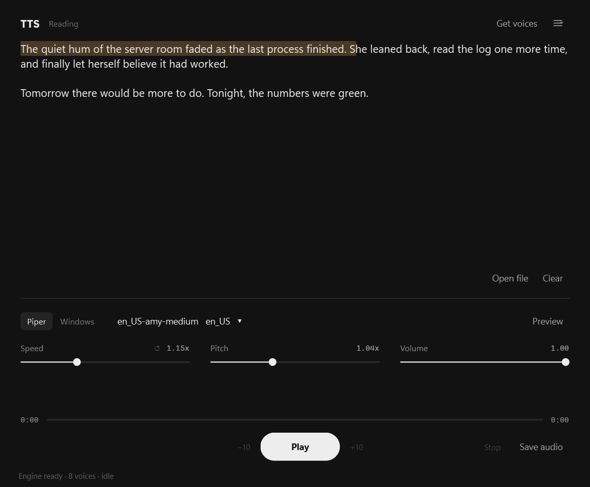

# TTS App

Local-first, free, MIT-licensed text-to-speech desktop app for Windows. Paste text, pick a voice, hit play. Or press `Ctrl+Alt+S` from anywhere and it reads your clipboard.

Speech is synthesized on your machine; the only network traffic is downloading voice models. No telemetry. No accounts.



## Why

I read a lot of articles. Existing options either phone home, cost money, sound like 2003, or require a terminal. This is the one I want on my desktop.

## Engines

| Engine         | Quality | Notes                                                                                      |
|----------------|---------|--------------------------------------------------------------------------------------------|
| **Supertonic** | High    | Neural ONNX, CPU, 10 English voices. Optional extra (`.[supertonic]`); fetches its model on first use. Preferred when installed. |
| **Piper**      | High    | Neural ONNX, CPU-only, ~60 MB per voice. Runs in-process via `piper-tts`, else `piper.exe`. |
| **SAPI5**      | Medium  | Windows built-in, zero-config fallback (`pyttsx3`).                                        |

**RVC (experimental).** Converts Piper's speech into another voice using an RVC model. It needs `torch` and `rvc-inferpy` 0.10.2 installed by hand (see `RvcEngine.install_hint()`; on Windows that includes a fairseq build for your Python), and turns on once at least one `.pth` model is imported via ☰ → RVC voice models. Pick which Piper voice it converts from in Preferences. The first conversion downloads HuBERT and RMVPE (~300 MB).

## Install

Requirements:

- Windows 10/11
- Python 3.11+ on PATH (`winget install Python.Python.3.11`)
- Optional: Supertonic voices — `.\.venv\Scripts\pip install -e ".[supertonic]"` after installing
- Optional: `ffmpeg` on PATH if you want MP3/OGG export
- Optional: `piper.exe` on PATH or in `assets/bin/`, used only if the `piper-tts` package can't load (download from <https://github.com/OHF-Voice/piper1-gpl/releases>)

One-shot install:

```powershell
git clone <this-repo> C:\path\to\Text-to-speach
cd C:\path\to\Text-to-speach
.\install.ps1
```

That creates a venv, installs deps, drops a `TTS App.lnk` on your Desktop and Start Menu, and launches the app, which opens a short setup wizard the first time (engines, a Piper voice download, an audio test).

## Run

Double-click the desktop icon. Or:

```powershell
.\tts_app.bat
```

Or directly:

```powershell
.\.venv\Scripts\pythonw.exe launcher.py
```

## Hotkey and tray

Default global hotkey is `Ctrl+Alt+S`. Pressing it from any window reads your clipboard in the current voice; pressing it again on the same text stops. The clipboard text replaces what's in the editor.

While the hotkey is active the app lives in the system tray: closing the window hides it, and the tray menu has Show, Read clipboard, Pause/Resume and Quit. Quit from the tray or the ☰ menu.

To rebind or turn it off: ☰ → Preferences. Changes apply immediately.

## Adding voices

In-app: click **+ Add voice** → "Download Piper" → pick → Download.

By hand: drop `<voice_id>.onnx` and `<voice_id>.onnx.json` into `%LOCALAPPDATA%\TTSApp\voices\` and restart.

## Development

```powershell
.\.venv\Scripts\Activate.ps1
pip install -e ".[dev]"
pytest
ruff check src tests
mypy src
```

Project layout:

```
src/tts_app/
  engines/    # TTSEngine ABC + Supertonic, Piper, SAPI, RVC adapters
  audio/      # QAudioSink playback, WAV/MP3/OGG export
  text/       # sentence segmentation (playback, highlighting, export)
  ui/         # main window, voice browser, tray, preferences, first-run wizard
  config/     # config.json schema + store (pydantic)
  hotkey/     # global Ctrl+Alt+S
launcher.py   # pythonw entry point
tts_app.bat   # Windows launch shim
install.ps1   # creates venv + Desktop/Start Menu shortcuts
```

Tests don't need a sound card (playback tests use a fake audio sink). On a machine without a display, set `QT_QPA_PLATFORM=offscreen`.

Add a new engine: subclass `TTSEngine` in `src/tts_app/engines/`, register it in `engines/registry.py:build_default_engines()`. Tests in `tests/test_<engine>_engine.py`.

## Files written at runtime

- `%LOCALAPPDATA%\TTSApp\config.json` — settings
- `%LOCALAPPDATA%\TTSApp\voices\` — downloaded Piper voice models
- `%LOCALAPPDATA%\TTSApp\supertonic\` — Supertonic model (if installed)
- `%LOCALAPPDATA%\TTSApp\Logs\tts_app.log` (rotated) — runtime log; `launcher.log` there catches startup crashes

Delete the config file to reset to defaults (the first-run wizard shows again).

## License

MIT (see `LICENSE`). Piper voice models carry their own per-voice licenses (mostly MIT/CC0); see <https://huggingface.co/rhasspy/piper-voices>.
